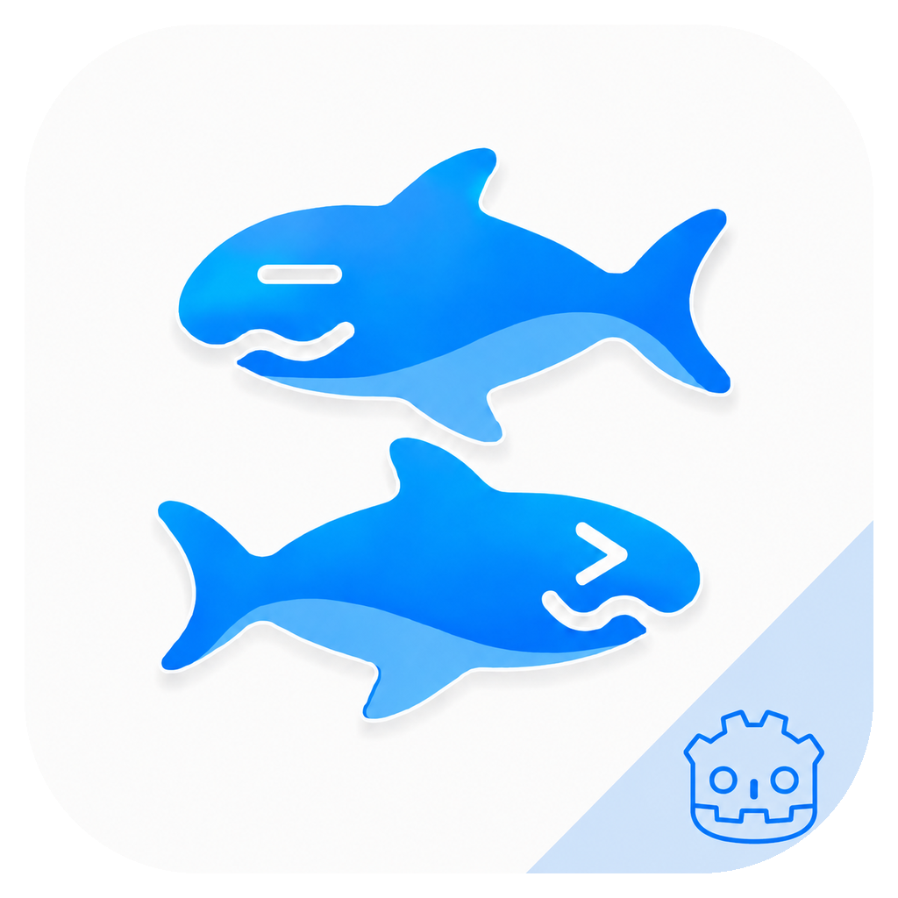

<p align="center">
  
</p>

<h1 align="center">AetherKiri</h1>

<p align="center">
  A Godot-hosted KiriKiri2 runtime with a C++ engine core and native mobile/desktop exports.
</p>

<p align="center">
  <a href="README.md">English</a> |
  <a href="README.zh-CN.md">简体中文</a>
</p>

<p align="center">
  <a href="https://github.com/AetherKiri/AetherKiri/actions/workflows/macos.yml"></a>
  <a href="https://github.com/AetherKiri/AetherKiri/actions/workflows/ios.yml"></a>
  <a href="https://github.com/AetherKiri/AetherKiri/actions/workflows/android.yml"></a>
</p>

<p align="center">
  <a href="https://github.com/AetherKiri/AetherKiri/blob/main/LICENSE"></a>
  <a href="https://github.com/AetherKiri/AetherKiri/commits/main"></a>
  <a href="https://github.com/AetherKiri/AetherKiri/issues"></a>
  <a href="https://github.com/AetherKiri/AetherKiri/pulls"></a>
  <a href="https://github.com/AetherKiri/AetherKiri"></a>
  <a href="https://github.com/AetherKiri/AetherKiri"></a>
</p>

## Overview

AetherKiri runs KiriKiri2 content inside a Godot 4.6 application shell. The
runtime is split into a native C++17 engine core, a C ABI bridge, and a Godot
GDExtension host that owns the product UI, render resources, settings, export
presets, and platform packaging.

The default product renderer is **Godot Native**: engine frames are rendered
through Godot-owned `RenderingDevice` resources. **GPU Bridge** remains an
explicit compatibility and performance comparison backend for external native
GPU render targets imported by Godot. **Debug CPU** is available as a visible
diagnostic fallback only.

```text
Godot App Shell
  -> GDExtension Host
    -> C ABI Engine API
      -> C++ Engine Core
        -> KiriKiri Runtime / Plugins
```

## Highlights

- Godot 4.6 app shell with native GDExtension integration.
- C++17 KiriKiri2 runtime core with visual, audio, storage, VM, and plugin
  support.
- Export paths for macOS, iOS/iPadOS, and Android.
- Runtime-selectable render backend with persisted settings.
- Probe scripts for smoke, render, interaction, performance, and manual repro
  sessions.
- GPL-3.0-or-later source distribution.

## Repository Layout

| Path | Purpose |
| --- | --- |
| `apps/godot_app/` | Godot project, scenes, settings UI, performance/log panel, icons, and export presets. |
| `bridge/godot_extension/` | Godot native host library entry points. |
| `bridge/engine_api/` | C ABI used by the host layer to drive the C++ engine. |
| `cpp/core/` | KiriKiri2 runtime, visual system, audio, storage, VM, and plugin support. |
| `cpp/plugins/` | Bundled native plugin implementations and compatibility stubs. |
| `tests/profiles/` | Per-game probe profiles. Committed profiles must not contain machine-local game paths. |
| `tools/` | Developer and compatibility tools built outside iOS/Android targets. |
| `doc/development.md` | Full developer guide for architecture, file roles, build, testing, probes, and debugging. |

## Render Backends

| Backend | Role | Status |
| --- | --- | --- |
| Godot Native | Godot-owned GPU rendering path. | Default product path |
| GPU Bridge | External GPU render-target bridge for comparison and compatibility. | Optional backend |
| Debug CPU | RGBA readback/upload fallback. | Debugging only |

The Godot settings UI persists the selected backend and warns when changing it
while a game session is active, because render resources must be recreated.

## Icon and Assets

The app icon shown above is the same icon configured by the Godot project:

- App icon: `apps/godot_app/assets/icon.png`
- SVG source used by the Godot project: `apps/godot_app/assets/icon.svg`
- Export icon set: `apps/godot_app/assets/icons/`
- Design source assets: `assets/sharks.svg` and `assets/apple_icon_mask.svg`

iOS and Android export presets reference the generated PNG sizes under
`apps/godot_app/assets/icons/`, including App Store and launcher sizes.

## Requirements

- CMake 3.28+
- Ninja
- vcpkg in `.devtools/vcpkg` or available through `VCPKG_ROOT`
- Godot at `/Applications/Godot.app` or `GODOT_BIN=/path/to/Godot`
- Xcode for macOS/iOS exports
- Android SDK/NDK for Android exports

Android builds use `ANDROID_HOME` or `ANDROID_SDK_ROOT` when set, otherwise
`$HOME/Library/Android/sdk`, and pick the newest installed NDK.

## Build

Common builds:

```bash
./build.sh macos debug
./build.sh macos release
./build.sh ios debug --simulator
./build.sh ios release
./build.sh android debug --abi=arm64-v8a
./build.sh android release --abi=arm64-v8a
```

The scripts build the native engine and Godot host library, stage them under
`apps/godot_app/bin/`, then run the matching Godot export preset when Godot is
available. Android is currently wired for `arm64-v8a`.

## Run and Test Artifacts

### macOS

Build and launch the exported app:

```bash
./build.sh macos release
open out/godot/macos/release/AetherKiri.app
```

Run the debug build from a terminal to inspect logs:

```bash
./build.sh macos debug
out/godot/macos/debug/AetherKiri.app/Contents/MacOS/AetherKiri
```

Add a game through the app UI, or pass a local test game only for the current
run:

```bash
AETHERKIRI_GAME_PATH="/path/to/game" \
out/godot/macos/debug/AetherKiri.app/Contents/MacOS/AetherKiri
```

### iOS Simulator

Build the simulator export:

```bash
./build.sh ios debug --simulator
```

Open the generated Xcode project, or install the built app with `simctl` after
building it from Xcode:

```bash
xcrun simctl boot "iPad Pro 11-inch (M4)"
xcrun simctl install booted /path/to/AetherKiri.app
xcrun simctl launch booted com.example.aetherkiri
```

The bundle identifier depends on the export preset and signing configuration.

### iOS Device

Build the iOS export project:

```bash
./build.sh ios release
```

Then build and install with Xcode or command line tools:

```bash
xcodebuild \
  -project out/godot/ios/release/AetherKiri.xcodeproj \
  -scheme AetherKiri \
  -configuration Release \
  -destination 'generic/platform=iOS' \
  -allowProvisioningUpdates \
  build
```

After Xcode creates `AetherKiri.app`, install it to a paired device:

```bash
xcrun devicectl list devices
xcrun devicectl device install app \
  --device <device-identifier> \
  /path/to/AetherKiri.app
```

On iOS/iPadOS, copy games through the Files app into:

```text
On My iPhone/iPad -> AetherKiri -> Games
```

Return to AetherKiri and tap refresh.

### Android

Build the debug APK:

```bash
./build.sh android debug --abi=arm64-v8a
```

The APK is written to:

```text
out/godot/android/debug/AetherKiri-debug.apk
```

Install and launch it on a connected device or emulator:

```bash
adb install -r out/godot/android/debug/AetherKiri-debug.apk
adb shell monkey -p org.github.krkr2.aetherkiri \
  -c android.intent.category.LAUNCHER 1
```

Build the release APK:

```bash
./build.sh android release --abi=arm64-v8a
```

The release APK is written to:

```text
out/godot/android/release/AetherKiri-release.apk
```

The release preset is intentionally unsigned until a project release keystore is
configured. Sign it before installing or distributing it:

```bash
apksigner sign --ks /path/to/release.keystore \
  out/godot/android/release/AetherKiri-release.apk
```

On Android, import games through the app UI on platforms with file-system
access. On restricted devices, copy the game directory into the app's
documents/storage location and use refresh.

## Validation

Useful migration checks:

```bash
rg "F[l]utter|f[l]utter|A[N]GLE|Platform[ ]Graphics" README.md README.zh-CN.md apps bridge build CMakeLists.txt
rg "u[n]official-angle|l[i]bEGL|l[i]bGLESv2" CMakeLists.txt bridge cpp build vcpkg.json
./build.sh macos debug
./build.sh ios debug --simulator
./build.sh android debug --abi=arm64-v8a
build/validate_godot_native.sh
build/validate_gpu_bridge.sh
```

Godot script checks:

```bash
/Applications/Godot.app/Contents/MacOS/Godot \
  --headless \
  --path apps/godot_app \
  --check-only \
  --quit
```

## Per-Game Probe Profiles

Probe scripts can be driven by `AETHERKIRI_TEST_CONFIG`. Keep committed profiles
generic; do not commit local absolute game paths. Use `AETHERKIRI_SMOKE_GAME` or
an untracked local profile for machine-specific paths.

Example smoke test:

```bash
AETHERKIRI_TEST_CONFIG="$PWD/tests/profiles/kr37s.json" \
AETHERKIRI_SMOKE_GAME="/path/to/game" \
/Applications/Godot.app/Contents/MacOS/Godot \
  --path apps/godot_app \
  --script res://scripts/smoke_test.gd
```

Example render/interaction probe:

```bash
AETHERKIRI_TEST_CONFIG="$PWD/tests/profiles/kr37s.json" \
AETHERKIRI_SMOKE_GAME="/path/to/game" \
/Applications/Godot.app/Contents/MacOS/Godot \
  --path apps/godot_app \
  --script res://scripts/step_render_probe.gd
```

Manual render probe for clicking through a repro:

```bash
AETHERKIRI_TEST_CONFIG="$PWD/tests/profiles/kr37s.json" \
AETHERKIRI_SMOKE_GAME="/path/to/game" \
/Applications/Godot.app/Contents/MacOS/Godot \
  --path apps/godot_app \
  --script res://scripts/manual_render_probe.gd
```

The manual probe forwards mouse, wheel, touch, and keyboard input to the game.
Press `F12` to save `/tmp/aetherkiri-manual-*.png`; press `Esc` to exit.

Profile fields:

- `game_path`: optional game directory or XP3 path. Keep blank in committed
  profiles unless the path is portable.
- `backend`: render backend, usually `Godot Native`.
- `surface_size`: engine render surface, for example `[1280, 720]`.
- `window_size`: probe window size.
- `coord_size`: coordinate space used by recorded click points.
- `startup_timeout_frames`, `warmup_frames`, `after_click_frames`,
  `measure_frames`: timing knobs.
- `clicks`: ordered interaction steps with `name`, `x`, `y`, and optional
  `after_frames`.
- `perf_input`: compatibility settings for `perf_input_probe.gd`.

Acceptance requires startup, rendering, input, menu operations, audio, save
paths, clean exit, and performance parity from Godot Native or GPU Bridge. Debug
CPU is only a diagnostic fallback.

## Documentation

- Developer guide: `doc/development.md`
- Plugin notes: `doc/krkr2_plugins.md`
- Tools: `tools/README.md`

## License

AetherKiri is distributed under GPL-3.0-or-later. See `LICENSE` for the full
license text.
