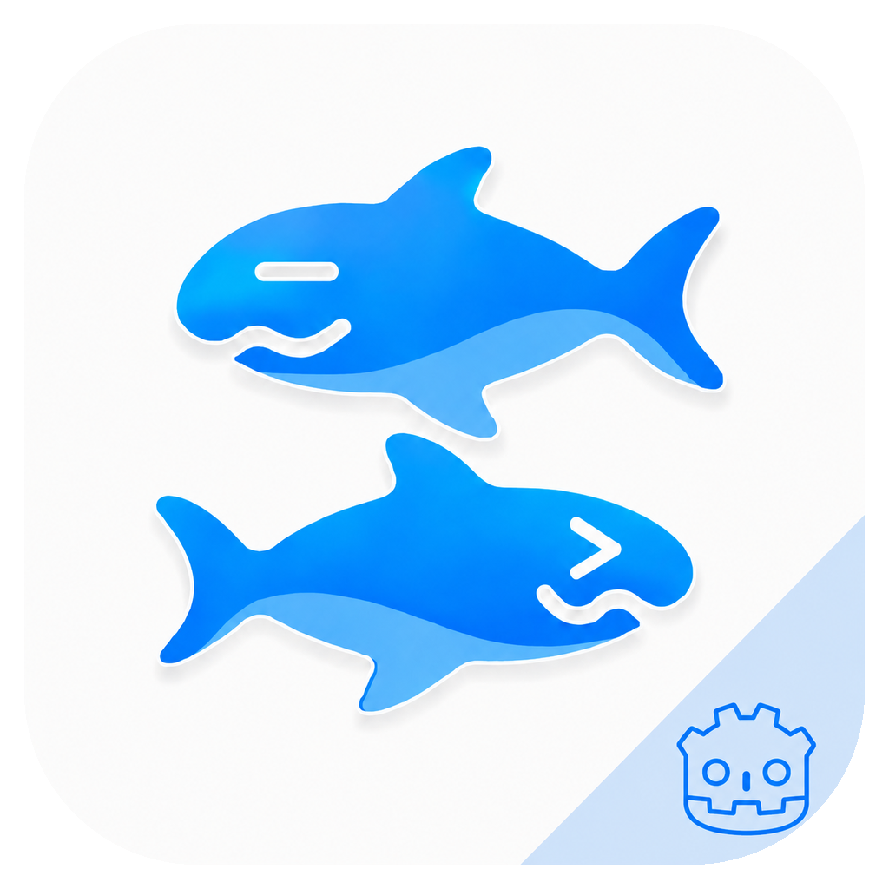

<p align="center">
  
</p>

<h1 align="center">AetherKiri</h1>

<p align="center">
  一个由 Godot 承载、可扩展的多 Runtime 视觉小说平台。<br>
  <a href="README.md">English</a> · <a href="README.zh-CN.md">简体中文</a>
</p>

<p align="center">
  <a href="https://github.com/AetherKiri/AetherKiri/actions/workflows/build.yml"></a>
  <a href="https://github.com/AetherKiri/AetherKiri/actions/workflows/build.yml"></a>
  <a href="https://github.com/AetherKiri/AetherKiri/actions/workflows/build.yml"></a>
  <a href="https://github.com/AetherKiri/AetherKiri/blob/main/LICENSE"></a>
</p>

## 项目概览

AetherKiri 在一个 Godot 4.7 应用内运行多个视觉小说引擎。统一的
`AetherRuntimePlayer` 通过版本化 Provider ABI 承载各原生 Runtime；Godot 负责
产品面：UI、最终帧显示、输入、设置、导出配置与平台打包。Runtime
Dispatcher 根据每个游戏的标记和能力选择对应引擎。

```text
Godot App Shell
  └─ AetherRuntimePlayer
       └─ Runtime Dispatcher
            ├─ KiriRuntime ─── KiriKiri2 Core / Plugins
            ├─ OnsRuntime ─── OnscripterYuri
            ├─ SiglusRuntime ─ siglus_rs
            ├─ A Runtime ───── Artemis（私有 package）
            └─ C Runtime ───── CatSystem2（私有 package）
```

默认产品渲染链路是 **Godot Native**：引擎帧通过 Godot 持有的
`RenderingDevice` 资源输出。**GPU Bridge** 是显式可选的兼容/对照后端，
用于导入外部原生 GPU render target；**Debug CPU** 仅作诊断 fallback。

## 亮点

- 唯一稳定的 `AetherRuntimePlayer` 与版本化 Provider ABI，接入当前及后续
  Runtime。
- C++17 KiriKiri2 引擎核心（视觉、音频、存储、VM、插件），以
  [`AetherKrkr`](https://github.com/AetherKiri/AetherKrkr) submodule 接入。
- 集成 OnscripterYuri，Godot 的鼠标/触摸/键盘输入会映射回 ONS 事件。
- 覆盖 macOS、iOS/iPadOS、Android、Web 与 Linux 的导出配置。
- 渲染后端可运行时切换并持久化设置。
- 内置多语言 KAG3 Demo，可从游戏库直接游玩，也可由玩家删除。
- 提供 smoke、渲染、交互、性能与手动复现 probe 脚本。
- 已验证游戏清单见 [`doc/verified_games.zh-CN.md`](doc/verified_games.zh-CN.md)。

分布式构建中，OnsRuntime、A Runtime 与 C Runtime 为 beta 功能，需要有效的
30 天 coffee entitlement；Debug 构建保持不受限，便于兼容性开发与测试。

## 平台支持

| 平台 | 最低要求 | 产品包 |
| --- | --- | --- |
| macOS | macOS 13.0（Ventura） | App Store（Apple Silicon） |
| iOS / iPadOS | iOS / iPadOS 16.0，`arm64` 真机 | App Store；另有模拟器开发构建 |
| Android | Android 8.0（API 26），`arm64-v8a` | GitHub Release APK |
| Web | 支持 wasm SIMD + threads、`SharedArrayBuffer`、COOP/COEP 的浏览器 | 自托管静态导出 |
| Linux | 自行编译 | `./build.sh linux release` 导出 `x86_64` |
| Windows | 自行编译 | 本地编译 native 目标 |

## 仓库结构

| 区域 | 路径 | 用途 |
| --- | --- | --- |
| 产品 | `apps/godot_app/` | Godot 项目：场景、设置 UI、游戏库、导出配置。 |
| ABI | `abi/` | 宿主层驱动 C++ 引擎的稳定 C ABI。 |
| 胶水 | `bridge/godot_extension/` | GDExtension 宿主入口。 |
| | `bridge/krkr2_runtime/` | KiriKiri2 集成胶水（legacy 引擎实现、host hooks）。 |
| | `bridge/onscripter_runtime/` | OnscripterYuri 无窗口宿主、帧读取、输入桥接。 |
| | `bridge/siglus_runtime/` | Siglus provider 与应用到 pristine `siglus_rs` 的构建期 overlay。 |
| 引擎 | `packages/AetherKrkr/` | KiriKiri2 引擎运行时 submodule。 |
| | `packages/OnscripterYuri/` | 公开 OnscripterYuri submodule。 |
| | `packages/AetherSiglus/` | 公开 siglus_rs submodule（保持只读）。 |
| | `packages/AetherInternal/` | 可选私有 E-mote package；公开构建不依赖它。 |
| 支撑 | `demos/aetherkiri-kag3/` | 内置 KAG3 Demo 源码。 |
| | `tests/` | 单元测试、fixture 与可移植 probe profile。 |
| | `tools/` | 开发与兼容工具（xp3 归档工具等）。 |
| 文档 | `doc/` | 开发指南、诊断、插件说明、已验证游戏、发布指南。 |

## 快速开始

### 环境要求

| 工具 | 用途 | 说明 |
| --- | --- | --- |
| CMake 3.28+、Ninja | 所有构建 | |
| NASM | 原生 FFmpeg | |
| vcpkg | 所有构建 | `.devtools/vcpkg` 或 `VCPKG_ROOT` |
| Godot 4.7 | 导出 | `/Applications/Godot.app` 或 `GODOT_BIN=/path/to/Godot` |
| Rust（rustup） | Siglus 运行时 | `rustup target add aarch64-linux-android`；无工具链时自动降级为“禁用 Siglus” |
| Xcode | macOS / iOS | 标签发布的 iOS 构建需要 iOS 26 SDK |
| Android SDK/NDK | Android | NDK `28.1.13356709`；`ANDROID_HOME` 或 `$HOME/Library/Android/sdk` |
| Emscripten（emsdk） | Web | `emcc`/`em++`/`emar` 在 PATH；Godot dlink 模板（`web_dlink_*.zip`） |
| Node.js + npm | Web dev server | TypeScript/Vite |
| E-mote SDK | 私有 E-mote 构建 | `packages/AetherInternal/tools/install_emote_sdk.sh` |

### 构建

```bash
git submodule update --init \
  packages/AetherKrkr packages/OnscripterYuri packages/psdfile \
  packages/AetherSiglus packages/AetherMinori
./build.sh macos debug        # 或：macos release / ios debug --simulator /
                               # ios release / android debug --abi=arm64-v8a /
                               # web debug / linux release
```

这五个公开 runtime submodule 是默认构建的最小集合（引擎仓是 configure
硬依赖；Siglus 与 Minori 在无 Rust 工具链时会优雅降级，但检出必须存在）。
`AetherInternal`、`tjs2Decompiler` 与 `rfvp` 为可选——见
[可选组件](#可选组件)。`AetherKrkr`、`psdfile`、`AetherMinori` 在
`.gitmodules` 中记录为 SSH URL；无 SSH 凭据时做一次 HTTPS 映射即可，与
GitHub 托管 runner 自动应用的重写一致：

```bash
git config --global url."https://github.com/".insteadOf git@github.com:
```

脚本会构建 native engine 与 Godot host library，将产物放到
`apps/godot_app/bin/`，并在 Godot 可用时运行对应的导出 preset。Linux 导出
会把所需的 vcpkg 共享库放在可执行文件旁边。

### 可选组件

- **私有 package**——拥有完整 E-mote 与原生 Live2D 实现权限的维护者，可在
  构建前启用：

  ```bash
  git submodule update --init packages/AetherInternal
  packages/AetherInternal/tools/install_emote_sdk.sh
  ```

  CMake 检测到 package 后自动启用；package/API 版本不一致时直接停止配置，
  不会静默产出不兼容组合。可信的 `Build` workflow 运行使用 `AETHERSECRET`
  只读 SSH 密钥；fork 与 Dependabot 运行走公开 fallback。可用
  `-DAETHERKIRI_ENABLE_INTERNAL=OFF` 显式验证公开 fallback。

- **Runtime 检出覆盖**——每个 submodule 都接受本地检出路径，便于引擎侧热
  迭代而无需提交 gitlink：`AETHERKIRI_KRKR_DIR`、
  `AETHERKIRI_ONSCRIPTERYURI_DIR`、`AETHERKIRI_SIGLUS_DIR`、
  `AETHERKIRI_MINORI_DIR`、`AETHERKIRI_RFVP_DIR`、`AETHERKIRI_INTERNAL_DIR`。

- **TJS2 分析辅助**——`git submodule update --init packages/tjs2Decompiler`
  （见 [development.zh-CN.md](doc/development.zh-CN.md#编译后-tjs2-分析)）。

- **Linux 引导**——Linux 环境为项目本地，所有工具下载保留在
  `.aetherkiri-cache/`（可用 `AETHERKIRI_CACHE_DIR` 覆盖）：

  ```bash
  ./tools/setup_linux.sh
  ```

## 运行

### macOS

```bash
./build.sh macos release
open out/godot/macos/release/Aether.app
```

Debug 构建可从终端启动查看日志，也可仅为当次运行传入本地测试游戏：

```bash
AETHERKIRI_GAME_PATH="/path/to/game" \
  out/godot/macos/debug/Aether.app/Contents/MacOS/Aether
```

### iOS / iPadOS

```bash
./build.sh ios debug --simulator     # 模拟器
./build.sh ios release               # 真机（Xcode 工程位于 out/godot/ios/release/）
```

真机构建用 Xcode 安装，或命令行：

```bash
xcodebuild -project out/godot/ios/release/Aether.xcodeproj \
  -scheme Aether -configuration Release \
  -destination 'generic/platform=iOS' -allowProvisioningUpdates build
xcrun devicectl device install app --device <id> <path>/Aether.app
```

通过“文件”App 将游戏复制到
`我的 iPhone/iPad → Aether → Games`，回到应用后点击刷新。

### Android

```bash
./build.sh android debug --abi=arm64-v8a
adb install -r out/godot/android/debug/Aether-debug.apk
adb shell monkey -p org.github.krkr2.aetherkiri -c android.intent.category.LAUNCHER 1
```

Release APK（`out/godot/android/release/Aether-release.apk`）在配置发布
keystore 前保持未签名——分发前请用 `apksigner` 签名。

### Web

```bash
source /path/to/emsdk/emsdk_env.sh
./build.sh web debug
npm install && npm run web:dev:debug   # 附带所需的 COOP/COEP 头
```

导出产物位于 `out/godot/web/<debug|release>/index.html`。云端部署通过浏览器
文件/目录选择器导入游戏，以按需 Range 读取挂载授权文件；存档持久化到当前
站点的 IndexedDB `/userfs`。仅限本地开发时，Vite 可通过
`AETHERKIRI_GAME_ROOT` 暴露只读测试游戏根（见
[development.zh-CN.md](doc/development.zh-CN.md)）。

## 渲染后端

| 后端 | 作用 |
| --- | --- |
| Godot Native | 默认产品链路——Godot 持有的 GPU 渲染。 |
| GPU Bridge | 可选后端，用于外部 GPU render target（兼容、对照）。 |
| Debug CPU | RGBA readback/upload fallback，仅用于诊断。 |

设置页会持久化所选后端；游戏会话中切换会提示需重启当前会话，因为渲染资源
必须重建。

## Runtime 说明

- **ONScripter 游戏**按标记文件识别（`0.txt`、`00.txt`、`nscript.dat`、
  `nscr_sec.dat`、`nscript.___`、`onscript.nt2`、`onscript.nt3`）。存档写入
  游戏的 `savedata/` 目录，应用更新后依然保留；默认脚本编码与上游一致
  （GBK），可用 `AETHERKIRI_ONS_ENCODING=gbk|sjis|utf8` 覆盖。ONS 的
  `mpegplay`/`avi`/`movie` 命令共用 AetherKiri 的 FFmpeg 媒体管线。集成
  授权与许可记录见[上游 issue #75](https://github.com/YuriSizuku/OnscripterYuri/issues/75)。
- **内置 Demo**——多语言 AetherKiri KAG3 Demo 随应用包分发，首次启动时
  自动加入游戏库，与导入游戏走完全相同的流程。删除时会一并清理可写副本与
  存档。源码：[`demos/aetherkiri-kag3/`](demos/aetherkiri-kag3/)。

## 测试与 Probe

```bash
AETHERKIRI_SMOKE_GAME="/path/to/game" \
  /Applications/Godot.app/Contents/MacOS/Godot --headless \
  --path apps/godot_app --script res://scripts/smoke_test.gd
```

Probe 配置（`AETHERKIRI_TEST_CONFIG`）、渲染/交互/性能 probe、profile 字段
与验收清单见
[development.zh-CN.md](doc/development.zh-CN.md#测试-profile-和-probe)。仓库
还提供最小 ONS fixture（`tests/fixtures/onscripter_smoke`）与 ONS 电影命令
fixture（`tests/fixtures/onscripter_movie_smoke/video.avi`）。

## 发布

SemVer 标签触发 `Release` workflow：App Store 签名、上传 App Store
Connect 与 GitHub Release。所需仓库 secrets 与商店打包流程见
[doc/release.zh-CN.md](doc/release.zh-CN.md)。

## 文档

| 文档 | 内容 |
| --- | --- |
| [`doc/development.zh-CN.md`](doc/development.zh-CN.md) | 开发指南：架构、文件作用、构建、测试、probe、调试。 |
| [`doc/diagnostics.zh-CN.md`](doc/diagnostics.zh-CN.md) | 应用内调试、一条命令采集、证据优先调查。 |
| [`doc/krkr2_plugins.md`](doc/krkr2_plugins.md) | KiriKiri2 插件说明。 |
| [`doc/verified_games.zh-CN.md`](doc/verified_games.zh-CN.md) | 已手动验证的游戏清单。 |
| [`doc/release.zh-CN.md`](doc/release.zh-CN.md) | 标签发布与 App Store 签名指南。 |
| [`tools/README.md`](tools/README.md) | 工具说明。 |

## 许可证

AetherKiri 以 GPL-3.0-or-later 分发（`LICENSE`）；第三方授权声明保留在
`THIRD_PARTY_LICENSES.md`。Apple App Store 分发相关的有限额外许可见
`COPYING.iOS`：仅供 Aether 官方 iOS/macOS 版本或版权持有人书面授权的发布者
使用；第三方分支及衍生 App 不得援引，该许可不代表其他版权持有人授予上游或
第三方材料的权利，也不撤销 GPL 已授予的权利。
